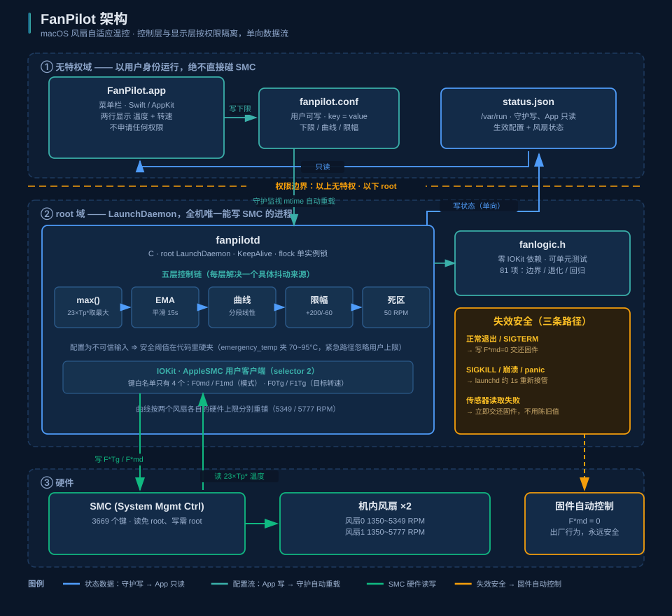

<p align="center">
  
</p>

<h1 align="center">FanPilot</h1>

<p align="center">
  <b>macOS 菜单栏风扇自适应温控</b><br/>
  按温度自动调速，装上就不用管。
</p>

<p align="center">
  
  
  
</p>

---

## 这是什么

macOS 不让你控制风扇转速。机器凉的时候风扇完全停转，热起来才由固件接管——而固件的启动阈值很高（本机实测 **68.8 °C 时风扇仍是 0 转**）。

FanPilot 接管这件事：读 CPU 核心温度，按一条曲线连续调节两个风扇，并保证一个**转速下限**（默认 2000 RPM），让机器始终有气流。

它的设计目标不是"散热最强"，而是**恰到好处且永不失控**：

| | |
|---|---|
| **自适应** | 23 个核心温度传感器取最大值 → 五层平滑 → 连续调速，无阶跃、无抖动 |
| **可控** | 菜单栏里点一下改转速下限，曲线自动跟着重新铺开 |
| **省资源** | 守护常驻 **CPU 0.10%** · RSS 5.7 MB · 亚 2ms 定时器 **0/s** |
| **失效安全** | 任何异常都回到出厂的「固件自动控制」，绝不把风扇留在低速 |

> ⚠️ 本工具直接写 SMC 风扇寄存器。所有目标值都被夹在硬件自己报告的 `F*Mn`~`F*Mx` 范围内，
> 且 90 °C 以上强制打满且忽略一切用户配置。但你仍应了解自己在做什么。

---

## 安装

> **要求**：Apple Silicon Mac · macOS 13+ · 与其它风扇控制软件**互斥**（两者会抢写 SMC）

### 第 0 步：先做兼容性预检（只读，什么都不改）

FanPilot 依赖 SMC 的 `F*Tg` 键可写、`FNum` 可读、`Tp*` 传感器存在。这些在不同机型上不一定成立，
所以**先确认你的机器支不支持，再装东西**——不要先装一个 root 守护、然后才发现不兼容。

```bash
tar -xzf FanPilot-1.0.1.tar.gz && cd FanPilot-1.0.0
bash install/precheck.sh
```

输出示例（本机）：

```
── SMC 接口（决定能不能用）
  ✅ SMC 可读（IOServiceMatching("AppleSMC") 成功）
  ✅ 检测到 2 个风扇（FNum）
  ✅ 风扇0: 范围 1350~5349 RPM · 当前 2014 RPM · 模式 0（0=固件 1=手动）
  ✅ 风扇1: 范围 1350~5777 RPM · 当前 2018 RPM · 模式 0
  ✅ 温度传感器可读（当前最热 53.7 °C）
── 冲突检查
  ✅ 无其它风扇控制软件
  ✅ 完全兼容，可以安装
```

有 ❌ 阻断项就**不要装**。预检完全只读，不会改动任何东西。

### 方式 A：用安装包（推荐）

从 [Releases](https://github.com/neosun100/FanPilot/releases/latest) 下载 `FanPilot-1.0.1.tar.gz`：

```bash
tar -xzf FanPilot-1.0.1.tar.gz
cd FanPilot-1.0.0
bash install.sh
```

`install.sh` 会依次做 5 件事，每步都会打印结果：

| 步骤 | 做什么 | 要 sudo？ |
|---|---|:--:|
| 1 | 解除 Gatekeeper 隔离（见下方说明） | ❌ |
| 2 | 跑兼容性预检 + 冲突检查，**有阻断项就中止** | ❌ |
| 3 | 装控制守护 `fanpilotd`（root LaunchDaemon） | ✅ |
| 4 | 装菜单栏 App 到 `/Applications` + 开机自启 | ❌ |
| 5 | 跑 25 项验收，全绿才算成功 | ✅ |

> **为什么要 sudo**：写 SMC 风扇寄存器需要 root（读不需要）。守护是**全机唯一**能写 SMC 的进程；
> 菜单栏 App 完全无特权，只读状态文件。这个权限边界是刻意划的，见[架构](#架构)。

> **关于 Gatekeeper**：包内二进制是 **ad-hoc 签名**（自用工具，没有 Apple Developer ID）。
> 从网上下载的文件带 `com.apple.quarantine` 属性，Gatekeeper 会拒绝执行。
> `install.sh` 第一步执行 `xattr -dr com.apple.quarantine` 解除——
> 这不是绕过安全机制，而是你对自己下载的东西做**显式授信**。
> 介意的话请走方式 B 从源码编译。

### 方式 B：从源码编译

不想信任预编译二进制就自己编。需要 **Xcode Command Line Tools**（`xcode-select --install`）：

```bash
git clone https://github.com/neosun100/FanPilot.git
cd FanPilot

make                 # 编译守护 fanpilotd 与命令行工具 fanctl（C，无第三方依赖）
make precheck        # 兼容性预检（只读）
make install         # 装 root LaunchDaemon（会要 sudo）
make verify          # 25 项验收，含反向断言

make app                        # 编译菜单栏 App（需要 Swift 6+）
bash install/install-app.sh     # 装 App + 开机自启（不需要 sudo）
```

跑一遍全部测试（可选，133 项）：`make test`

### 装了什么、装在哪

装 root 守护这种事应该完全透明：

| 路径 | 内容 | 谁的 |
|---|---|---|
| `/usr/local/sbin/fanpilotd` | 控制守护（约 80 KB，纯 C） | root |
| `/Library/LaunchDaemons/com.newmac.fanpilotd.plist` | 守护的 launchd 配置（`RunAtLoad` + `KeepAlive`） | root |
| `/usr/local/etc/fanpilot/fanpilot.conf` | 配置（`key = value`，带注释） | **你**（App 要能改） |
| `/var/run/fanpilot.status.json` | 运行状态（守护写，`0644`） | root 写 / 所有人可读 |
| `/var/log/fanpilotd.log` | 守护日志 | root |
| `/Applications/FanPilot.app` | 菜单栏 App（约 300 KB） | 你 |
| `~/Library/LaunchAgents/com.newmac.fanpilot.menu.plist` | App 的开机自启 | 你 |

不装任何内核扩展、不改 SIP、不装第三方依赖、不联网。

### 确认装好了

```bash
cat /var/run/fanpilot.status.json      # 应看到实时温度与两个风扇的目标/实际转速
sudo launchctl print system/com.newmac.fanpilotd | grep -E 'state|runs'
```

`state = running` 且 `runs = 1` 就对了。**`runs` 短时间暴涨说明守护在崩溃重启循环**（`KeepAlive` 在反复救它），
这时看 `/var/log/fanpilotd.log`。

菜单栏右侧应出现两行小字：上行温度、下行转速。

### 卸载

```bash
sudo bash install/uninstall.sh    # 守护
# App：
launchctl bootout gui/$(id -u)/com.newmac.fanpilot.menu
rm -f ~/Library/LaunchAgents/com.newmac.fanpilot.menu.plist
rm -rf /Applications/FanPilot.app
```

> 卸载脚本**先让守护把风扇交还固件，再删文件**。顺序反了会把风扇永久留在手动模式
> ——实测 SMC **不会**自动回退（停止写入 60 秒后仍保持手动）。脚本里还有一道无条件兜底，
> 即使守护的信号处理没跑成也会强制写回 `F*md=0`。

### 常见问题

**菜单栏没出现图标？**
App 是 `LSUIElement`（不进 Dock），只在菜单栏。若菜单栏项太多可能被折叠——
先确认进程在跑：`pgrep -x FanPilot`。日志在 `/tmp/fanpilot-menu.log`。

**显示「守护未运行」？**
`sudo launchctl print system/com.newmac.fanpilotd` 看状态，`/var/log/fanpilotd.log` 看原因。
最常见是**有其它风扇软件在抢写 SMC**——安装时会检测并拒绝，但如果是装完之后才装的其它软件就不会被拦。

**改转速下限报 Permission denied？**
配置属主被改成了 root。修：`sudo chown $(whoami) /usr/local/etc/fanpilot/fanpilot.conf`
（原子写需要**目录**也可写，所以配置放在专属目录 `/usr/local/etc/fanpilot/` 下）。

**风扇一直不转 / 转速是 0？**
先跑预检确认 `F*Tg` 可写。若守护 `mode` 显示 `stopped_firmware_auto`，
说明它已交还固件——固件在凉的时候本来就让风扇停转（本机实测 68.8 °C 时仍是 0 转）。

---

## 使用

<p align="center">
  
</p>

菜单栏两行：上行最热核心温度、下行两个风扇的平均转速。

固定宽度 23pt，四种状态宽度一致，**不会横跳挤占其他图标**。状态标记是**贴底细条**而不是 emoji：

- **正常** —— 无标记
- **紧急全速** —— 贴底实心条（温度 ≥ 90 °C，忽略限幅直接打满）
- **风扇故障** —— 贴底虚线条（实际转速持续低于目标 55%）
- **固件接管** —— 整体变淡（守护已退出，风扇回到出厂控制）

> 为什么不用 emoji：模板着色模式下 AppKit 只用 alpha 通道，🔥 会变成一坨纯黑块。
> 为什么标记贴底而不放左侧：4 位转速（如 `5349`）占满全宽时，左侧标记会压在数字上。

点开下拉面板可以看到：当前模式、最热与平滑后温度、每个风扇的实际/目标/硬件范围/故障标记、
生效中的全部参数、累计 SMC 写入次数，以及两个开关——**转速下限**（6 档）和**开机自动启动**。

改完下限**即刻生效**：守护监视配置文件 mtime 自动重载，不需要编辑配置文件、不需要输密码、
也不需要点什么"重新加载"。

> 下限只决定**空闲时的地板转速**，不改变高温时的散热能力——曲线永远铺到硬件上限。
> 真实的取舍是「空闲噪音 ↔ 温度基线」。

---

## 架构

<p align="center">
  
</p>

两层按权限隔离，数据单向流动：

- **`fanpilotd`**（root LaunchDaemon，C）—— 全机唯一能写 SMC 的进程。`flock` 单实例锁，`KeepAlive` 兜底。
- **`FanPilot.app`**（菜单栏，Swift/AppKit）—— **无任何权限**，只读状态 JSON，绝不碰 SMC。

配置文件对用户可写（否则无特权的 App 改不了设置），因此**配置被当作不可信输入**：所有安全阈值在守护代码里硬夹，不相信文件里写的值。

### 五层控制链

```
23×Tp* → max() → EMA(15s) → 分段曲线 → 非对称限幅 → 死区(50 RPM) → 写 SMC
         局部热点   瞬时尖峰    温度→转速    升200/降60      抑制无谓写入
```

每层解决一个具体的抖动来源。**非对称限幅是"丝滑"的关键**：散热要快（升 200 RPM/s）、安静要稳（降 60 RPM/s）。

### 曲线自适应

配置里的曲线是**形状模板**。抬高下限时整条曲线按 `[下限, 硬件上限]` 重新铺开，而不是被夹平：

| 下限 | 45 °C | 55 °C | 65 °C | 75 °C | 85 °C |
|---:|---:|---:|---:|---:|---:|
| 2000 | 2000 | 2609 | 3421 | 4334 | 5349 |
| 3000 | 3000 | 3427 | 3997 | 4637 | 5349 |
| 4000 | 4000 | 4245 | 4572 | 4940 | 5349 |

两个风扇的硬件上限不同（实测 5349 / 5777 RPM），曲线**按各自上限分别重铺**。

### 失效安全

| 场景 | 机制 | 暴露窗口 |
|---|---|---|
| 正常退出 / `SIGTERM` / 卸载 | 信号处理器写 `F*md=0` 交还固件 | 0 |
| `SIGKILL` / 崩溃 / 内核 panic | launchd `KeepAlive` 重启，新实例接管 | ~1 s |
| 传感器读取失败 | 立即交还固件，不用陈旧值继续控制 | 0 |

实测确认 **SMC 不会自动回退**（停止写入 60 秒后仍保持手动模式），所以 `KeepAlive` 不是可选项而是安全机制本身。

⭐ 转速下限本身也是失效安全：守护死掉时风扇保持最后转速，最坏情况是**卡在 ≥2000 RPM**——比出厂固件空闲时的 0 转风量还大，失效方向偏安全。

---

## 测试

```bash
make test     # 单元 81 + 验收 25 + E2E/回归 27 = 133 项
```

| 层 | 内容 |
|---|---|
| `tests/unit_logic.c` | **81 项** —— `fanlogic.h` 全部纯逻辑：正常路径 + 边界 + 退化输入（0 / 负 / 除零 / NaN） |
| `install/verify.sh` | **25 项** —— 运行状态、失效安全断言、资源预算、反向断言 |
| `tests/e2e.sh` | **27 项** —— 完整用户路径 + **10 条按真实 bug 编号的回归**（R1~R10） |

纯决策逻辑全部剥离到 `src/fanlogic.h`（零 IOKit 依赖），否则它与 IOKit 缠在一起时**只能靠跑真机观察，无法单元测试**。

**反向断言和正向断言一样重要**——只验"能用"会漏掉"不该能用的也能用"。例如：越界转速必须被拒、第二个实例必须启动失败、恶意配置的安全阈值必须被夹住。

---

## 文档

| | |
|---|---|
| [`docs/SMC-RESEARCH.md`](docs/SMC-RESEARCH.md) | SMC 逆向调研：键位、可写性判定、传感器筛选方法、全部实测数据 |
| [`docs/PLAN.md`](docs/PLAN.md) | 设计与开发计划：控制算法、安全红线、资源预算、被推翻的设计 |

调研工具（全部只读，不写任何 SMC 键）：

```bash
make research
./research/smcprobe    # 枚举全部 3669 个 SMC 键 + 风扇现状
./research/sensors     # 传感器普查 + 可写性属性
./research/sample 70 2 # 时序采样（判传感器响应性用）
./research/bench       # 读取开销基准
```

> 🩸 **传感器必须按「时序方差」筛，不能按瞬时值筛。** 按数值排最热的两个键是 `Tf06`=88.81 °C 与
> `Tf16`=85.97 °C，看着像热点告警——实测 70 秒 35 个样本**标准差 0.000**，它们是常量
> （很可能是固件跳闸点），不是实时温度。判据是方差，不是瞬时值。

---

## 兼容性

在 **MacBook Pro M5 Max (Mac17,6) / macOS 26.6.2 / SIP 启用**上开发与实测。

不硬编码任何机型参数：风扇数量取自 `FNum`，上下限取自 `F*Mn`/`F*Mx`，传感器在启动时枚举。
理论上适用于有可写 `F*Tg` 键的 Apple Silicon Mac，但**只在上述机型验证过**。

---

## 许可

MIT
